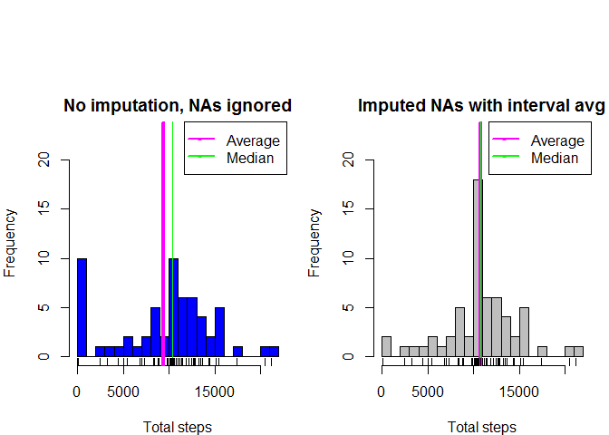

# Reproducible Research: Peer Assessment 1

## Loading and preprocessing the data

```r
if(!file.exists(file.path("rawdata","activity.csv"))) {
    unzip(file.path("activity.zip"), overwrite = FALSE, exdir = "rawdata")
}
library(dplyr)
```

```
## 
## Attaching package: 'dplyr'
```

```
## The following objects are masked from 'package:stats':
## 
##     filter, lag
```

```
## The following objects are masked from 'package:base':
## 
##     intersect, setdiff, setequal, union
```

```r
thedata <- tbl_df(read.csv(file.path("rawdata","activity.csv"), stringsAsFactors = FALSE)) %>%
    mutate(date = as.Date(date)) %>%
    mutate(datefactor = as.factor(date))
```
Raw data summary:

```r
summary(thedata)
```

```
##      steps             date               interval           datefactor   
##  Min.   :  0.00   Min.   :2012-10-01   Min.   :   0.0   2012-10-01:  288  
##  1st Qu.:  0.00   1st Qu.:2012-10-16   1st Qu.: 588.8   2012-10-02:  288  
##  Median :  0.00   Median :2012-10-31   Median :1177.5   2012-10-03:  288  
##  Mean   : 37.38   Mean   :2012-10-31   Mean   :1177.5   2012-10-04:  288  
##  3rd Qu.: 12.00   3rd Qu.:2012-11-15   3rd Qu.:1766.2   2012-10-05:  288  
##  Max.   :806.00   Max.   :2012-11-30   Max.   :2355.0   2012-10-06:  288  
##  NA's   :2304                                           (Other)   :15840
```

```r
str(thedata)
```

```
## Classes 'tbl_df', 'tbl' and 'data.frame':	17568 obs. of  4 variables:
##  $ steps     : int  NA NA NA NA NA NA NA NA NA NA ...
##  $ date      : Date, format: "2012-10-01" "2012-10-01" ...
##  $ interval  : int  0 5 10 15 20 25 30 35 40 45 ...
##  $ datefactor: Factor w/ 61 levels "2012-10-01","2012-10-02",..: 1 1 1 1 1 1 1 1 1 1 ...
```

```r
table(is.na(thedata$steps))
```

```
## 
## FALSE  TRUE 
## 15264  2304
```

## What is mean total number of steps taken per day?

```r
per_date <- group_by(thedata, datefactor) 
dailysteps <- summarize(per_date, totalsteps = sum(steps, na.rm = TRUE), 
                        averagestepsperinterval = mean(steps, na.rm = TRUE), 
                        medianstepsperinterval = median(steps, na.rm = TRUE))
meanstepsperday <- as.integer(round(mean(dailysteps$totalsteps, na.rm = TRUE)))
medianstepsperday <- median(dailysteps$totalsteps, na.rm = TRUE)
hist(dailysteps$totalsteps, breaks = 25, col = "blue", main = "Total number of steps taken each day (NAs ignored)")
abline(v= meanstepsperday, col = "magenta", lwd = 4)
abline(v=medianstepsperday, col = "green")
legend("topright", pch = "-", lwd = 2 , col = c("magenta", "green"), legend = c("Average", "Median"))
rug(dailysteps$totalsteps)
```

<!-- -->
  
Mean total number of steps taken per day (NAs ignored) = 9354  
Median of total number of steps taken per day (NAs ignored) = 10395


## What is the average daily activity pattern?

```r
per_interval <- group_by(thedata, interval)
intervalsteps <- summarise(per_interval, averagesteps = mean(steps, na.rm = TRUE))
plot(x = intervalsteps$interval, y = intervalsteps$averagesteps, 
     main = "Average daily activity pattern", col = "red", type = "l",
     xlab = "Intervals", ylab = "Average number of steps")
```

<!-- -->

```r
maxstepsperinterval <- max(intervalsteps$averagesteps)
intervalwithmax <- intervalsteps[which.max(intervalsteps$averagesteps), "interval"]
intervalwithmax[[1]][[1]]
```

```
## [1] 835
```
Which 5-minute interval, on average across all the days in the dataset, contains the maximum number of steps?  
Answer: 835

## Imputing missing values

```r
completecases <- complete.cases(thedata)
```
Number of observations with missing values: 2304  
Are there entire days with only NAs?  

```r
dailyaverages <- summarise(per_date, sumsteps = sum(steps, na.rm = TRUE), average = mean(steps, na.rm = TRUE), median = median(steps, na.rm = TRUE))
table(is.na(dailyaverages))
```

```
## 
## FALSE  TRUE 
##   228    16
```
Yes.  
Are there average values for all intervals?

```r
table(is.na(intervalsteps))
```

```
## 
## FALSE 
##   576
```
Yes.  
Impute the average number of steps for an interval whenever the steps value is missing.


```r
imputeddata <- thedata
#The steps variable is an integer, but when imputing the average it needs to be changed to a numeric
imputeddata <- mutate(imputeddata, steps = as.numeric(steps))
for (i in 1:17568) {
    if(is.na(imputeddata[i,"steps"])) {
        imputeddata[i,"steps"] <- intervalsteps[(intervalsteps$interval == imputeddata[[i,"interval"]]), "averagesteps"]
    }
}
per_date_imputed <- group_by(imputeddata, datefactor) 
dailystepsimputed <- summarize(per_date_imputed, totalsteps = sum(steps), averagestepsperinterval = mean(steps), 
    medianstepsperinterval = median(steps))

meanstepsperdayimputed <- as.integer(round(mean(dailystepsimputed$totalsteps, na.rm = TRUE)))
medianstepsperdayimputed <- as.integer(round(median(dailystepsimputed$totalsteps, na.rm = TRUE)))

#Display the two plots next to one another, and overlay the interval means.
par(mfrow = c(1,2), mar = c(4,4,2,1), oma = c(0,0,5,0))
#plot1
hist(dailysteps$totalsteps, breaks = 25, col = "blue", 
     main = "No imputation, NAs ignored", xlab = "Total steps",
     ylim = c(0,23))
legend("topright", pch = "-", lwd = 2 , col = c("magenta", "green"), legend = c("Average", "Median"))
abline(v= meanstepsperday, col = "magenta", lwd = 4)
abline(v=medianstepsperday, col = "green")
rug(dailysteps$totalsteps)

#plot2
hist(dailystepsimputed$totalsteps, breaks = 25, col = "grey", main = "Imputed NAs with interval avg", 
     xlab = "Total steps",
     ylim = c(0,23))
legend("topright", pch = "-", lwd = 2 , col = c("magenta", "green"), legend = c("Average", "Median"))
abline(v= meanstepsperdayimputed, col = "magenta", lwd = 4)
abline(v=medianstepsperdayimputed, col = "green")
rug(dailystepsimputed$totalsteps)
```

<!-- -->
  
###Before imputation:  
Mean total number of steps taken per day (NAs ignored) = 9354  
Median of total number of steps taken per day (NAs ignored) = 10395  

###After imputation:  
Mean total number of steps taken per day (NAs ignored) = 10766  
Median of total number of steps taken per day (NAs ignored) = 10766  

##What is the impact of imputing missing data on the estimates of the total daily number of steps?  
The average and median total number of steps per day have increased slightly, and are now also identical.  
The frequency of zero values have decreased substantially, and the frequency of the average/median values have
increased equally substantially.

## Are there differences in activity patterns between weekdays and weekends?

```r
#Adding a factor indicating weekday or weekend
wd <- weekdays(imputeddata$date)
daytype <- weekdays(imputeddata$date) %in% c("Saturday", "Sunday")
wd[daytype] <- c("weekend")
wd[!daytype] <- c("weekday")
imputeddata <- mutate(imputeddata, daytype = factor(wd))

per_daytype_imputed <- group_by(imputeddata, daytype, interval) 
daytypestepsimputed <- summarize(per_daytype_imputed, totalsteps = sum(steps, na.rm = TRUE), 
                               averagestepsperinterval = mean(steps, na.rm = TRUE), 
                               medianstepsperinterval = median(steps, na.rm = TRUE))

library(lattice)
xyplot(averagestepsperinterval ~ interval|daytype, data = daytypestepsimputed, 
       layout = c(1,2), type = "l", ylab = "Number of steps")
```

<!-- -->
  
Yes, there are differences in step patterns between weekends and weekdays. Weekdays peak eaerlier in the day, whereas weekends have a general higher levele throughout the day.
